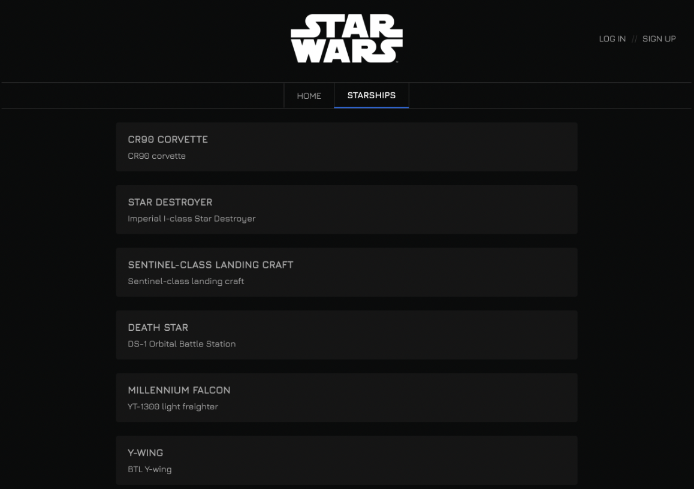
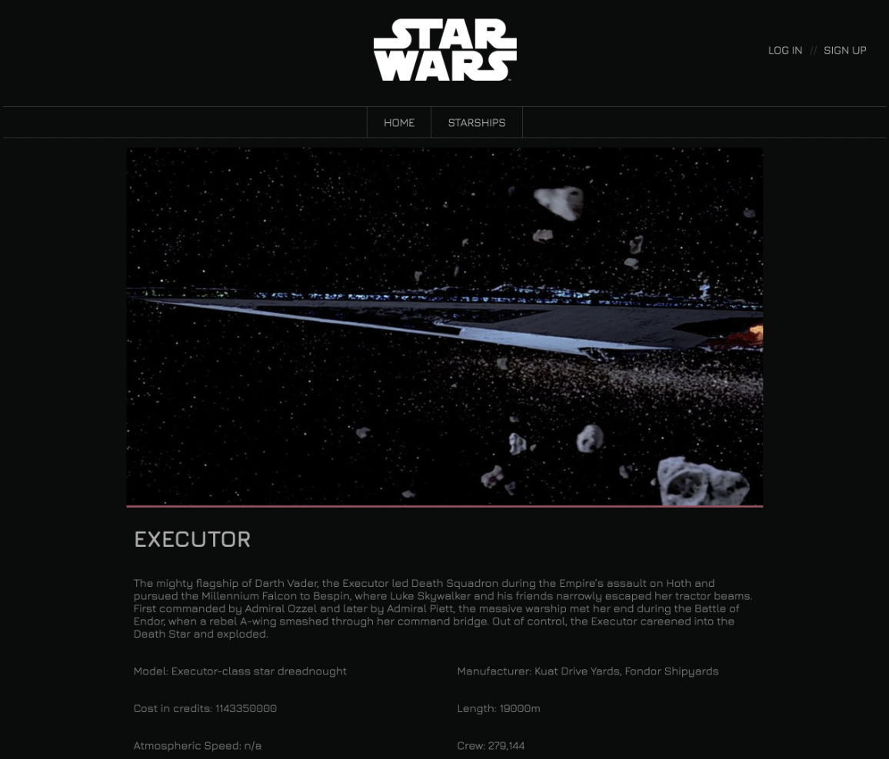

# S8. Star Wars

This project was bootstrapped with [Create React App](https://github.com/facebook/create-react-app).

A website with information about `Star Wars spaceships.`

We will consume API data, displaying it on the screen in a list, and we will implement the detail of each item in the list.

# 🚀 Level 1

## `Exercise 1`

To begin with, the first step we are going to implement the main screen where the list of spaceships are displayed.

When we get the list of items from the server, we are going to see that it returns many interesting data about each spaceship, but on the main screen we will only show the most important data so as not to overload the cliente with information.

Data to show for each spaceship on the list:

- Spaceship name
- Model

## `Exercise 2`

In this exercise you must create the card of each ship, showing all its details.

The user will be able to access the details of each ship by clicking on each of the ships on the list:

## `Exercise 3`

Here we must solve the limitation of 10 ships. The API indicates that there are a total of 36 ships, which we will show the user on demand.

We will implement a button at the end of the list of ships, with the text "view more", which allows us to obtain more ships from the server and add them to the list of ships shown to the user.

## `Exercise 4`

In this step we want to work thoroughly with the visual style, so that it resembles the official Star Wars website.

## `Exercise 5`

We will implement an initial welcome page, and by means of a button, it will be possible to access the main ship page. To do this, you must use React routing.

In addition to the access button on the main page, the user will have access to the main page through the top navigation bar.

We will use a component, you will need to create the top navigation bar.

## `Exercise 6`

We will implement a login and registration screen, in which through localstorage, since we do not have a user authentication server, they can be registered and rented later if they exist.

# 🚀🚀 Level 2

## `Exercise 7`

We will slightly modify the navigation, so that when the registered user is not detected, they will be taken to "login".

The list of ships can only be visible to registered users, you must protect the routes.

## `Exercise 8`

We will add the card of each ship showing the cards of its pilots and we will create a new component to display these cards within the ship detail.

## `Exercise 9`

We will show the cards of the movies in which the ship has appeared.

# 🚀🚀🚀 Level 3

## `Exercise 10`

Since this application can grow larger, to prepare a good base guaranteeing that no bugs appear in the future, you will have to implement `unit tests.`

Create unit test for at least three components.

